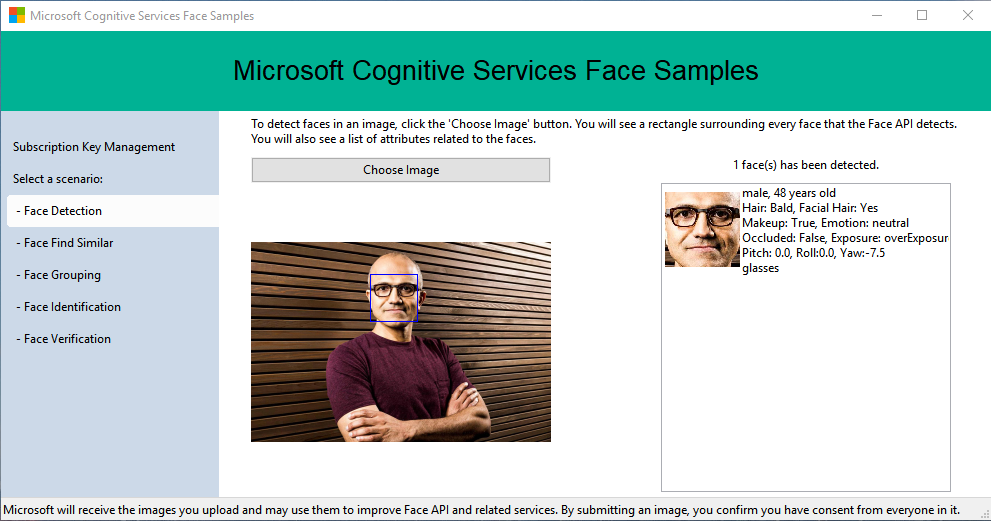

# Microsoft Face API: Python SDK & Sample

[](https://pypi.org/project/cognitive_face/)
[](https://github.com/Microsoft/Cognitive-Face-Python/blob/master/LICENSE)

This SDK has been deprecated and been replaced by [Microsoft.Azure.CognitiveServices.Vision.Face](https://github.com/Azure/azure-sdk-for-python/tree/master/sdk/cognitiveservices/azure-cognitiveservices-vision-face) which is a part of Azure SDK.

This repo contains the Python SDK for the Microsoft Face API, an offering within [Microsoft Cognitive Services](https://azure.microsoft.com/en-us/services/cognitive-services/), formerly known as Project Oxford.

* [Learn about the Face API](https://azure.microsoft.com/en-us/services/cognitive-services/face/)
* [Documentation & API Reference & SDKs](https://docs.microsoft.com/en-us/azure/cognitive-services/face/)

## Getting started

Install the module using [pip](https://pypi.python.org/pypi/pip/):

```bash
pip install cognitive_face
```

Use it:

```python
import cognitive_face as CF

KEY = 'subscription key'  # Replace with a valid Subscription Key here.
CF.Key.set(KEY)

BASE_URL = 'https://westus.api.cognitive.microsoft.com/face/v1.0/'  # Replace with your regional Base URL
CF.BaseUrl.set(BASE_URL)

img_url = 'https://raw.githubusercontent.com/Microsoft/Cognitive-Face-Windows/master/Data/detection1.jpg'
result = CF.face.detect(img_url)
print result
```

### Installing from the source code

```bash
python setup.py install
```

### Running the unit tests

To run the tests you will need a valid subscription. You can get one [here](https://azure.microsoft.com/en-us/try/cognitive-services/?api=face-api).

1. Copy `cognitive_face/tests/config.sample.py`  into `cognitive_face/tests/config.py`.
1. Change the `KEY` and `BASE_URL` parameters to your own subscription's API key and endpoint.
1. Run the following:

```bash
python setup.py test
```

## Running the sample

A sample desktop application is also provided.

Currently it support the following combination of prerequisites:

1. [Python 3](https://www.python.org/downloads/) + [wxPython 4](https://pypi.python.org/pypi/wxPython) **[Recommended]**
1. [Python 2](https://www.python.org/downloads/) + [wxPython 4](https://pypi.python.org/pypi/wxPython)
1. [Python 2](https://www.python.org/downloads/) + [wxPython 3](https://sourceforge.net/projects/wxpython/files/wxPython/3.0.2.0/)

P.S. WxPython 3 does not support Python 3 by design.

Then run the following:

```bash
git clone https://github.com/Microsoft/Cognitive-Face-Python.git
cd Cognitive-Face-Python
pip install -r requirements.txt
python sample
```




## Contributing

We welcome contributions. Feel free to file issues and pull requests on the repo and we'll address them as we can. Learn more about how you can help on our [Contribution Rules & Guidelines](/CONTRIBUTING.md).

You can reach out to us anytime with questions and suggestions using our communities below:
 - **Support questions:** [StackOverflow](https://stackoverflow.com/questions/tagged/microsoft-cognitive)
 - **Feedback & feature requests:** [Cognitive Services UserVoice Forum](https://cognitive.uservoice.com)

This project has adopted the [Microsoft Open Source Code of Conduct](https://opensource.microsoft.com/codeofconduct/). For more information see the [Code of Conduct FAQ](https://opensource.microsoft.com/codeofconduct/faq/) or contact [opencode@microsoft.com](mailto:opencode@microsoft.com) with any additional questions or comments.

## Updates
* [Face API Release Notes](https://docs.microsoft.com/en-us/azure/cognitive-services/face/releasenotes)

## License
All Microsoft Cognitive Services SDKs and samples are licensed with the MIT License. For more details, see
[LICENSE](/LICENSE.md).

Sample images are licensed separately, please refer to [LICENSE-IMAGE](/LICENSE-IMAGE.md).

## Developer Code of Conduct
Developers using Cognitive Services, including this sample, are expected to follow the “Developer Code of Conduct for Microsoft Cognitive Services”, found at [http://go.microsoft.com/fwlink/?LinkId=698895](http://go.microsoft.com/fwlink/?LinkId=698895).
